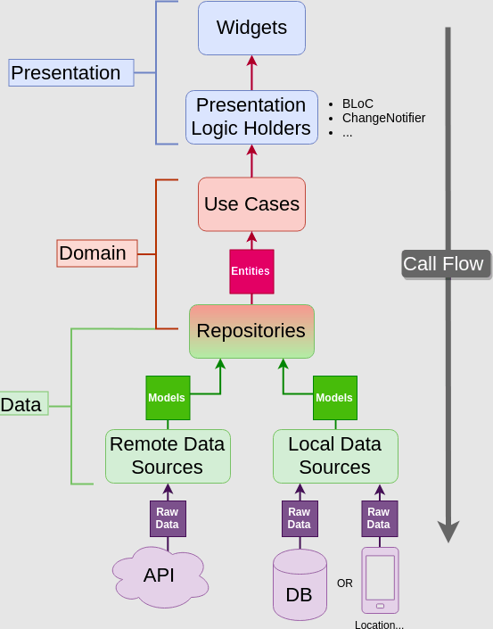

# Flutter clean architecture

## Clean Architecture

    هذا المشروع هو تطبيق الClean architecture الخاصة بRobert Martin المعروف بUncle Bob , ايضاً يحوي على الطريقة الصحيحة للبدء بتطبيق هذا البنية وكيفية تقسيم المشروع الخاص بنا في Flutter بحيث يتوافق مع هذه البنية .

 
 

## Initial project

- أولا سنقوم بإنشاء مشروع Flutter جديد وإضافة المكتبات اللازمة خلال المشروع وايضا تقسيم المشروع إلى المجلدات المناسبة للبنية المستخدمة وإضافة ملف الثيم.

 مجلد features : يحتوي على كل مميزات features خاصة بالتطبيق، و كل ميزة نضعها في مجلد خاص بها ونقسمه الى البنية الخاصة ب clean architecture الموضحة في feature_exemple.

 
 

## Domain layer

- ثانيا نقوم بإنشاء ال entity الخاصة بطبقة domain ومن ثم كتابة الrepository و إضافة جميع الuse cases الخاصة بال feature.

 
 

## Data layer

- بعد ذلك نبدأ بالdata layer ونقوم بكتابة ال model والبدء بتحقيق (implements) الrepository الخاصة بال domain layer. ثم نكمل العمل على datasources بانشاء كلاس ال Local Data Source وايضاً ال Remote Data Source و تحقيقهما (implements).

 
 

## Presentation layer 
### Implement bloc in presentation layer 

- ثم نبدأ بال presentation layer وتحديداً بمعالجة موضوع ال state management وسنقوم بكتابة جميع ال bloc خاص بال feature.

 
 

### Dependency injection

- بعد ذلك نصل الى ال Dependency injection ، ونقوم بمعالجتها باستخدام مكتبة get_it.

 ننشأ ملف injection_container و نكتب فيه جميع dependency injection خاصين بكل ال features.

 
 

### Create Page in pages in presentation layer

- وأخيرا نبدأ بإنشاء و بكتابة الشاشات الInterfaces خاصة بال feature.

 
 

### How does it wrok

- اولا نبعث event لل bloc من ال pages في طبقة ال presentation.
- ال bloc بعد تلقي event يحكي مع ال usecase.
- ال usecase هي بدورها تحكي مع ال repository.
- ال repository يتحقق من اذا الجهاز فيه انترنت، اذا فيه انترنت يحكي مع ال remote data source و اذا لا يوجد انترنت يذهب لل local data source. 
- مثلا يوجد انترنت، ال remote data source يبعث request لل api، هذا الاخير يرجع response، ثم هذه data source تحول response ل model و تعيدو على repository.
- ال repository يحول  ال model الى entitie.
- ترجع هذه ال entitie الى usecase.
- ثم نستعمل هذه ال usecase في ال bloc.
- و أخيرا نستعمل نوع ال response من ال usecase لتحديد ال state في هذا page.

 
 

